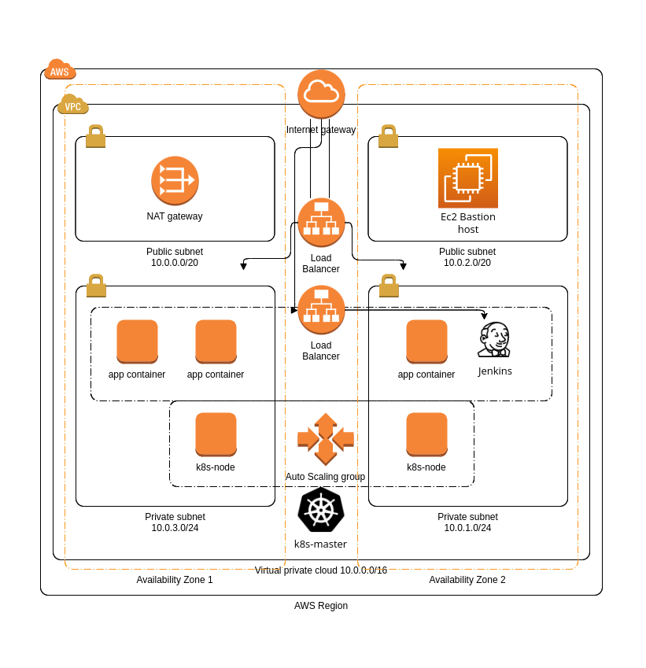
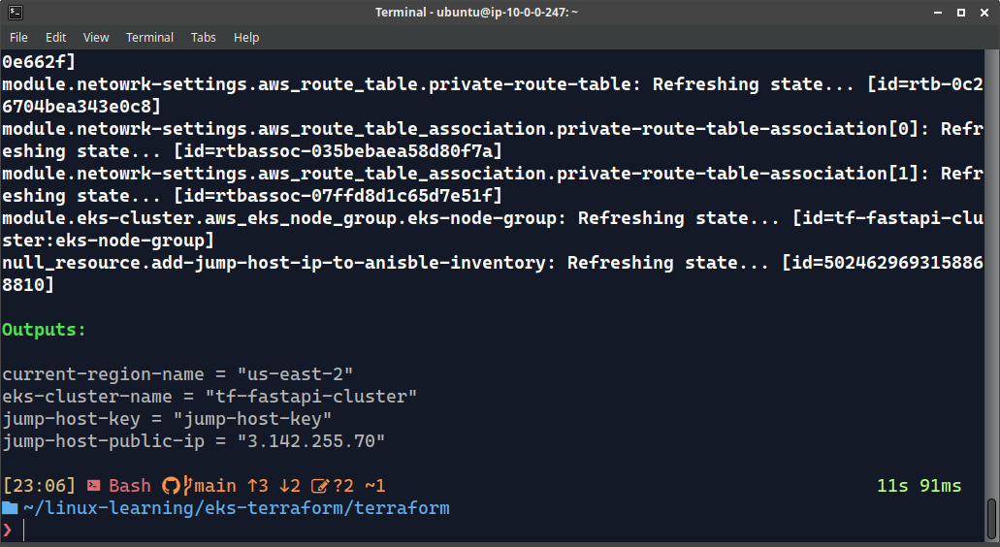
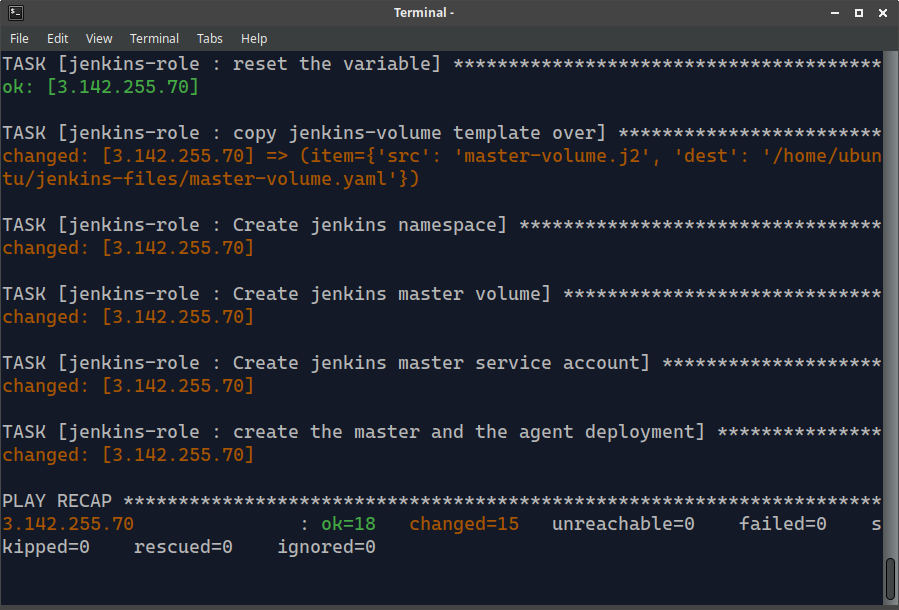
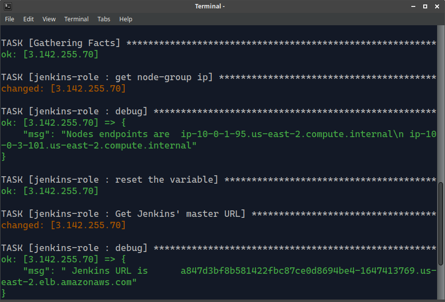

# CI/CD Pipeline Documentation

The objective of this project is to establish a CI/CD pipeline for deploying an Instance Segmentation Model application. The pipeline incorporates various technologies such as Terraform for infrastructure provisioning, Ansible for configuration management, and Jenkins for continuous integration and deployment (CI/CD). The application's source code can be found at [this GitHub repository](https://github.com/Abdullah-Elkasaby/Automated-Instance-Segmentation-model-API-Deployment-with-CI-CD/tree/beta).

# Project Diagram

# Components 
 
## 1.Terraform 
is used to provision  different infrastructure that are divided into three different custom-made modules

- **Network module** which is associated with components suchs VPCs, NAT-Gateways, subnets, route tables, etc.

- **Jump-Host module** creates a a fully configured public EC2 instance  
- EKS module is responsible for the EKS Cluster, Cluster-NodeGroup, Auto Scaling Group and all the required IAM Roles.

## 2.Ansible
The Ansible structure for this purpose consists of two roles, each serving specific tasks:

- **Jump-Host Role**  utilized to automate the configuration of the public EC2 instance.

- **Jenkins Role** deployment on the EKS cluster is achieved through the use of manifests and Ansible scripts.

## 3. Jenkins
Jenkins structure includes a Master and an Agent Deployment that is used as a node and retrieves the source code for the application and creates a pipeline to build and deploy the application.

- Using Jenkins, the pipeline can incorporate multiple stages, including building and testing the application, containerizing it with Docker, and deploying it to the EKS cluster. Each stage is executed in a controlled and automated manner, ensuring consistency and repeatability throughout the pipeline.

## 4.Helm
- a package manager for Kubernetes, to streamline the deployment process. It utilizes a custom-made Helm chart specifically designed for the application, which encapsulates the necessary Kubernetes deployment and service configurations. Jenkins interacts with the EKS cluster through Helm, deploying and managing the application with ease.

## Prerequisites
Before setting up the CI/CD pipeline, ensure that you have the following prerequisites:

1. An Amazon Web Services (AWS) account with appropriate permissions to create resources.
2. Installed and configured Terraform, Ansible on your local machine.

## Step 1: Setting up the Private EKS Cluster with Terraform

1. Clone the repository containing the Terraform configuration for creating the EKS cluster.
2. Modify the Terraform variables in the configuration files to suit your requirements (e.g., region, cluster name, node instance type).

3. Inside the Terraform direcrtory Run `terraform init` to initialize the Terraform working directory.
4. Run `terraform plan` to preview the resources that will be created.
5. Run `terraform apply` to create the EKS cluster and related resources.

## Step 2: Automating Jump Host Configuration with Ansible

1. Inside the Ansible directory are the  playbooks and roles for configuring the jump host.
2. Modify the Ansible variables in the playbook files to configure the jump host according to your needs.
3. The jump-host-role must have a file in the vars directory named `vault.yaml` which shoud contain your credinitals to AWS encrypted using `ansible-vault encrypt`
4. Run the Ansible playbook using the `ansible-playbook` command to automate the jump host configuration.

## Step 3: Jenkins Master and Agent Deployment

1. Ansible automates the deployment process of jenkins, all you have to do is configure it.
2. Access the URL from ansible output on port 8080 using the password printed below the url.
3. Create a user using the retrieved password.
3. Configure the Jenkins master and agent using the Jenkins UI.
4. Create a Jenkins pipeline job that pulls the source code for the FastAPI application and performs the necessary build steps.

## Step 4: Deploying FastAPI Endpoint with Jenkins
1. Run the Jenkins pipeline job that deploys the Helm chart to the EKS cluster using the GitHub Repo.

## Conclusion

This documentation provides an overview of setting up a CI/CD pipeline using Terraform, Ansible, Jenkins, Helm, and Docker. By following the steps outlined in this document, you will be able to create a private EKS cluster, automate jump host configuration, deploy Jenkins master and agent, deploy a FastAPI endpoint, and containerize the application. Remember to customize the configurations according to your specific requirements and project needs.